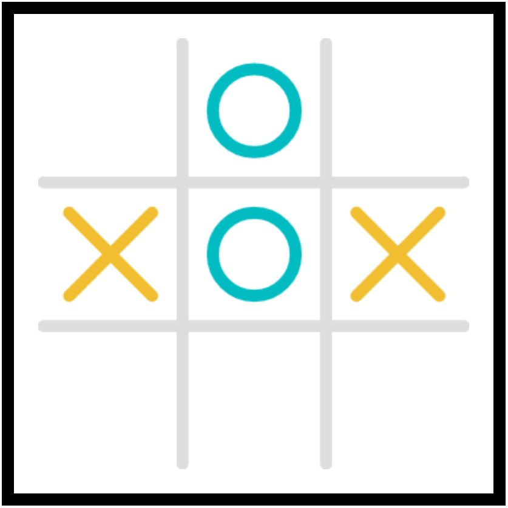
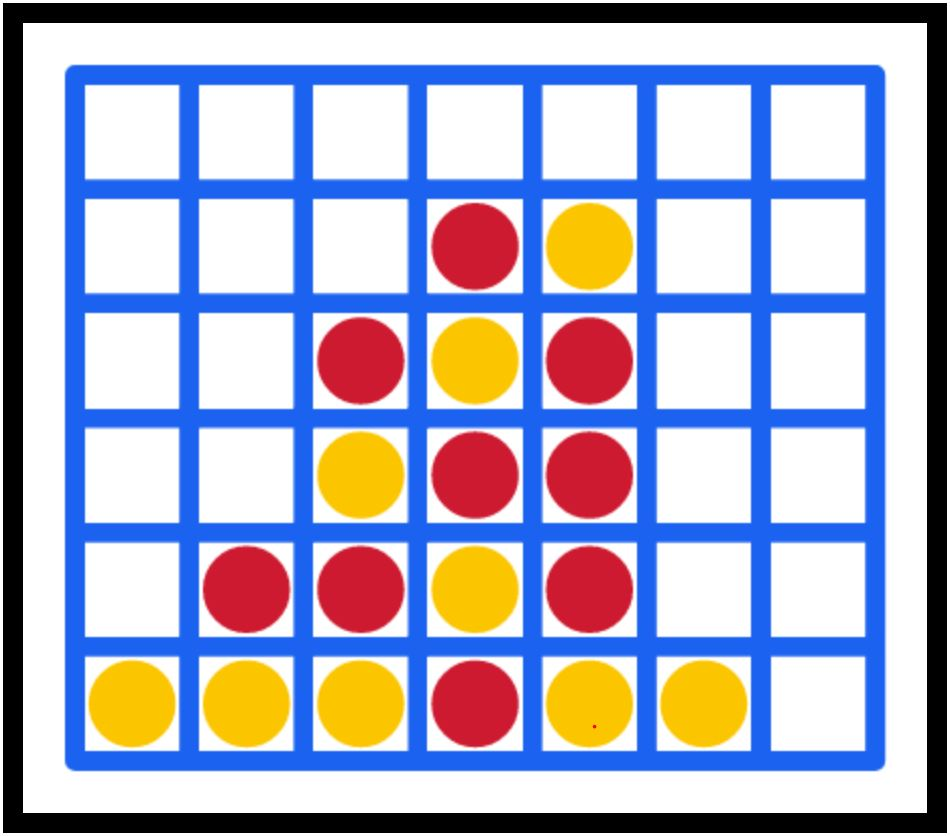

# KokoRawr

A Slack app that allows teams to simultaneously play a series of multi-player games. Slack users are placed on one of the two teams depending on their username who then compete in a series of multi-player games.

The list of the games available are as followed.

### Tic Tac Toe
 <!-- .element height="50%" width="50%" -->
Similar to the classic game of Tic Tac Toe, teams take turns to place X's or O's on tiles. When it's a team's turn, its users rapidly send commands of tile locations on the slack page. Then the move displayed on the board is based on what the first user sent. A team wins once they place tiles to make a complete row, column, or diagonal. Each win increases a team's score by 1 point.

### Connect 4

### Battleship

### Rock Paper Scissors

### Duck Duck Gooses
There's not much to say; you're either a duck or a goose. Users are randomly chosen to be a duck or goose. Ducks gain 1 point for the team, while geese lose 5 points for the team.
